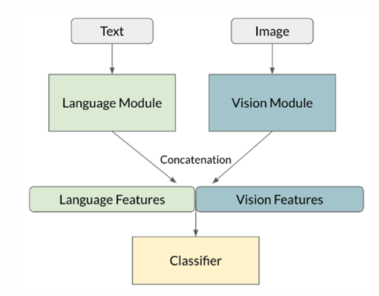
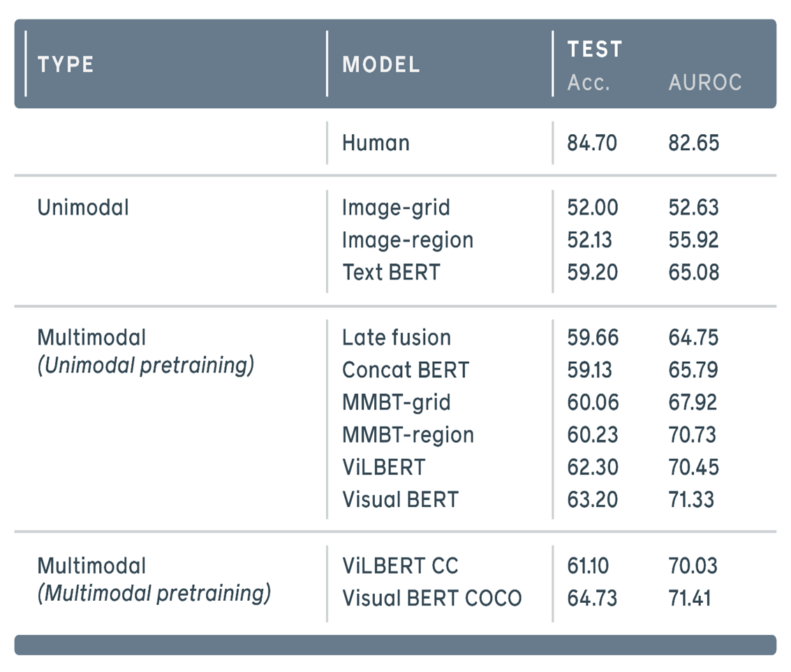

# MemeSense: A Hateful Meme Detector

MemeSense is a tool that can identify if a meme is hateful or not based on its text and image content.

# Contents
* [Installation Instructions](#installation-instructions)
* [Background](#background)
  * [Motivation](#motivation)
  * [Previous work](#previous-work)

* [Hateful Memes Dataset](#hateful-memes-dataset)

* [Starting point](#starting-point)

* [Modifications and Add-ons](#modifications-and-add-ons)
  * [Kornia Augmentations](#kornia-augmentations)
  * [Optuna](#optuna)
  * [Trial and error with a variety of pretrained models (Transfer Learning)](#trial-and-error-with-a-variety-of-pretrained-models-transfer-learning)
  * [OCR](#ocr)

* [Results and Comparisons](#results-and-comparisons)

* [Summary](#summary)

* [Bibliography](#bibliography)

# Installation Instructions 
*	Register to Kaggle if you haven't already.
*	Open our notebook.

*	In order to get access to accelerators – enter your phone number. 
There are GPU and TPUs accelerators for use with different weekly hours each (20 – 30 hours). Choose one of them.
*	The last thing left is to run the notebook.
In the top toolbar, click on Run -> Start Session and when you see a green indicator that the Draft session is on, run a cell with Shift + Enter or choose in the top toolbar     Run -> Run all.

# Background

## Motivation

Memes are a common way of expressing opinions and emotions on social media, using images and texts together to create funny or ironic messages. However, some memes are not meant to entertain but to offend. These are hateful memes, which use images and texts to spread hate against specific groups of people based on their religion, gender, color, etc. 

Hateful memes can have serious consequences for the victims of hate speech, such as mental harm, social exclusion, or fear of violence. They can also affect the attitudes and actions of other users who see them, possibly increasing intolerance and radicalization. 

To prevent hateful memes from harming individuals and society, it is essential to develop effective solutions to detect them.  

Detecting hateful memes is a difficult task because it requires understanding the complex and subtle interactions between the visual and textual components of the meme.                           For example, a meme might use an innocent image with a sarcastic caption to mock a certain group or might use an image of a desert or an empty space, with a caption that says: “Look how many people love you” or something similar. This means that a meme that may seem harmless on its image and its text separately may be harmful when they are combined. For example, if the text is “Look how many people love you” and the image is a crowd of cheering fans, the meme isn’t harmful. 

## Previous work

Most existing methods rely on either the image or the text of the meme
separately, ignoring the multimodal nature of the problem. Therefore,
Facebook launched a competition aimed at identifying hateful memes.

# Hateful Memes Dataset

The Hateful Memes Dataset is a multimodal dataset for hateful meme
detection that contains 10,000+ new examples created by Facebook AI. It
was designed specifically to help AI researchers develop new systems
that can understand the content and detect multimodal hate speech.

Each sample in the dataset is composed of a meme image with a label
where ‘0’ indicates non – a hateful meme while ‘1’ indicates a hateful meme.

In practice (in code), the dataset is imported as JSON Lines files where
each file contains lines of id, image file name, its associated text and
label.

The Hateful Memes Dataset consists of three parts: a train set, a
validation set, and a test set. The train set contains 8,500 samples with
class imbalance – less hateful memes; the validation set contains 500
samples and the test set contains 1,000 samples – both sets with
neglectable class imbalance. The Hateful Memes Dataset is available for
download from Facebook AI’s website, from “Papers With Code”, or from
Kaggle

The dataset also comes with code for baseline-trained models that can be
used as a starting point.

# Starting point

The starting point model combines image and text features from Resnet
and Fasttext, respectively. The code is written with PyTorch Lightning,
a package that simplifies the development and training of deep learning
models. The model achieves an accuracy score of 0.534 on a test set,
which indicates a low level of performance.

The model consists of two main components: an image feature extractor
and a text feature extractor. The image feature extractor is a Resnet152
model that takes an image as input and outputs a vector of features. The
text feature extractor is a Fasttext model from Facebook that takes text
as input and outputs a vector of features. The two feature vectors are
then concatenated and passed through a linear fully connected layer that
produces the final output, the class. The model is trained using
cross-entropy loss and optimized using an AdamW optimizer.

# Modifications and Add-ons

To improve the performance of the starting point model, we made several
modifications and add-ons to the original code and the architecture.
These include:

## Kornia Augmentations

We applied various image transformations using Kornia, a library that
provides differentiable computer vision operations for PyTorch using
the GPU. These transformations include random cropping, resizing,
rotation, horizontal flipping, color jittering, and adding Gaussian
noise with small variance. The purpose of these augmentations is to
increase the diversity of the image data and prevent overfitting

## Optuna

We used Optuna, a library that automates hyperparameter searching to
find the best values for hyperparameters such as learning rate,
dropout value for each layer separately, and the parameters of each
augmentation we used.

We defined the objective function as the validation error (zero – one
loss) of the model given a set of hyperparameters and used Optuna to
search for the optimal combination using a tree-structured Parzen
estimator (TPE) algorithm.

We used Optuna’s pruning feature to speed up the optimization process.
Pruning allows the study object to stop unpromising trials based on
the validation error reported every epoch. This resulted in a
significant reduction in the computation time.

## Trial and error with a variety of pretrained models (Transfer Learning) 

We experimented with different architectures and pretrained models for
both image and text feature extraction. For example, we tried using
BERT, RoBERTa, DistilBERT, and CLIPtext for text embedding, and we
tried using Resnet152, DenseNet121, EfficientNet ‘b5’, and CLIPvision
for image embedding. We compared their performance on the validation
set and selected the best one, CLIP.

## CLIP (Contrastive Language–Image Pre-training)

The CLIP model from OpenAI contains a text embedding model and an
image embedding model. CLIP pre-trained on a large-scale dataset of
images and captions together, so it has an understanding of both texts
and images. Each embedding model outputs a 512-dimensional vector.

## OCR

Our model architecture is useless when we don’t get our meme separated
into its image and text parts. Moreover, in real life, we can’t expect
our memes to come in this way due to the massive number of memes.

As a result, we investigated OCR (Optical Character Recognition)
models in order to extract the text from the memes. We focused only on
pretrained models and found 3 models to test with:

-   Pytesseract

-   Easyocr & OpenCV

-   docTR (Document Text Recognition)

Later, we had to define metrics to check which model gives us the most
similar results to the original text of the meme. We chose cosine
similarity but came to another problem how to convert texts to vectors
to calculate cosine similarity. We solved it with TF-IDF vectors
conversion and calculated average cosine similarity on 100 samples
from the train set.

# Results and Comparisons 
**Our model score:**

AUC-ROC Score: 0.72068

Accuracy: 0.664

From our modifications and Adds-Ons, we found that data augmentations didn’t improve our model.

Our model achieved an improvement of 13% in accuracy compared to the starting point.

Multimodal pretraining with CLIP model performed better than Unimodal pretraining with image and text pretrained and even better than the multimodal pretrained ViLBert.

Dropout for image and text separately was preferred by Optuna rather than a single value like in the starting point architecture.

The learning rate with the scheduler worked the best with ReducOnPlatue.

Trying LR Warmup to increase the learning rate at the beginning caused underfitting.

Besides AdamW optimizer, we tried SGD + momentum = 0.9 + Nesterov but our train loss couldn’t converge so we stayed with AdamW.

In our OCR experiment, we got much better results in Easyocr & OpenCV than the others.

# Summary

Despite our efforts to implement almost everything we saw from the course lecture, the limited resources we had and the size of the models we dealt with challenged us to think out of the box not just in terms of performance, but computation time and memory consumption. It led us to do tradeoffs which were valuable lessons for us.
For future work, we would suggest:
*	Hyperparameters tuning with Optuna to find the best hyperparameters for each model architecture and not just choosing one type of model like we did (time limit).
*	Report the loss value to Optuna for every few batches instead of each full epoch to get earlier pruning and make the hyperparameter search much faster.
*	Integrating OCR into our model to extract text from a meme. Before that, we would suggest doing fine-tuning instead of using pretrained models and training on more than just 100 train samples like we did just to show the concept.

## Authors

- [Aviv Shem-Tov](https://github.com/staviv)
- [Tomer Keniagin](https://github.com/toto9820)

# Bibliography

\[1\] <https://drivendata.co/blog/hateful-memes-benchmark/>

\[2\] [Hateful Memes Challenge and dataset
(facebook.com)](https://ai.facebook.com/blog/hateful-memes-challenge-and-data-set/)

\[3\] <https://pypi.org/project/pytesseract/>

\[4\]
https://pyimagesearch.com/2020/09/14/getting-started-with-easyocr-for-optical-character-recognition/

\[5\] https://github.com/mindee/doctr
